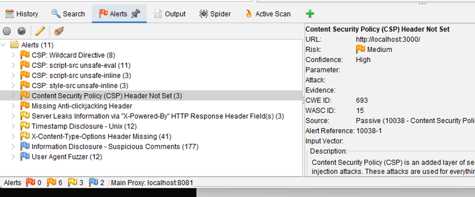
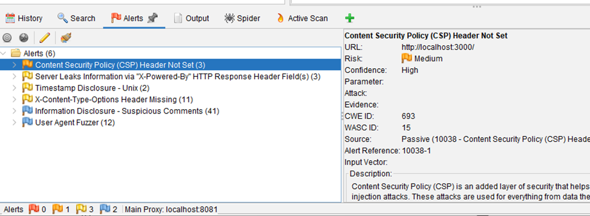
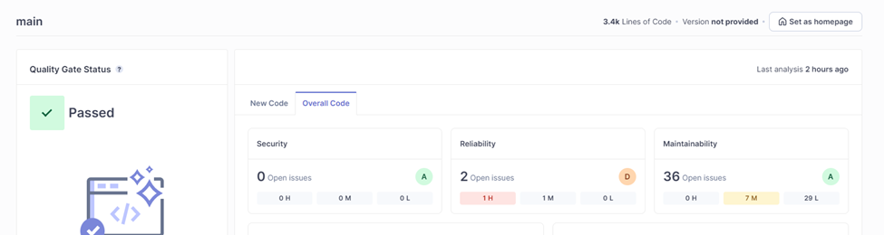
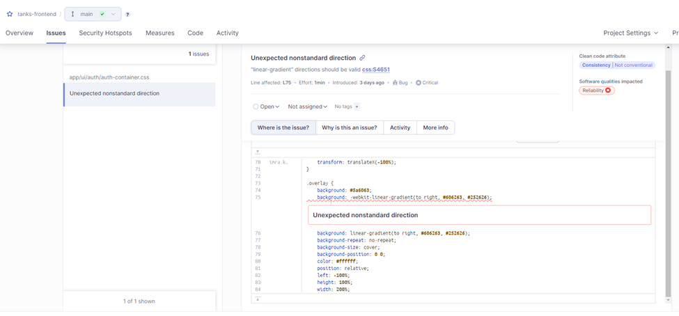
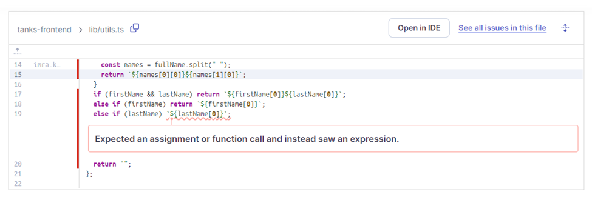
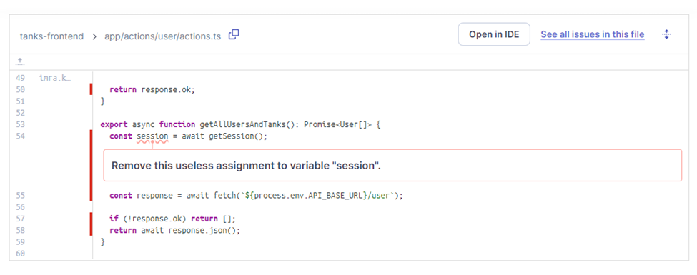
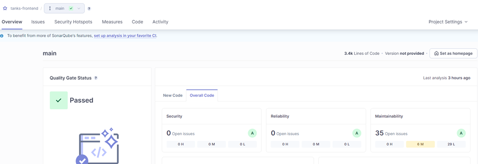

# Secure Coding
***
## Imra Kočiš
***

***Software Engineering,*** 
***Algebra University College,***
***June 2024***

***

### ***Content***

***
### Learning Outcome 1

#### Task
Use tools OWASP ZAP and Burp Suite to scan your application
for vulnerabilities. Choose three most significant vulnerabilities, document them, fix
them and re-scan the application to prove that the vulnerabilities are fixed.

#### Solution

##### OWASP ZAP


We have some medium risks, mostly regarding `CSP` (Content Security Policy).

Since this application is written in `Next.js v13.4.15`, we need to handle our headers 
almost from scratch.

If we follow official Next.js documentation we must set up middleware 
to handle all requests in our application, and still we are getting potential risks with 
CSP.

```javascript
import { NextResponse } from "next/server";

export function middleware(request) {
  const nonce = Buffer.from(crypto.randomUUID()).toString("base64");
  const cspHeader = `
    default-src 'self';
    script-src 'self' 'nonce-${nonce}' 'strict-dynamic' https: http: 'unsafe-inline' ${
      process.env.NODE_ENV === "production" ? "" : `'unsafe-eval'`
    };
    style-src 'self' 'nonce-${nonce}';
    img-src 'self' blob: data:;
    font-src 'self';
    object-src 'none';
    base-uri 'self';
    form-action 'self';
    frame-ancestors 'none';
    upgrade-insecure-requests;
`;
  // Replace newline characters and spaces
  const contentSecurityPolicyHeaderValue = cspHeader
    .replace(/\s{2,}/g, " ")
    .trim();

  const requestHeaders = new Headers(request.headers);
  requestHeaders.set("x-nonce", nonce);
  requestHeaders.set(
    "Content-Security-Policy",
    contentSecurityPolicyHeaderValue,
  );

  const response = NextResponse.next({
    request: {
      headers: requestHeaders,
    },
  });
  response.headers.set(
    "Content-Security-Policy",
    contentSecurityPolicyHeaderValue,
  );

  return response;
}

export const config = {
  matcher: [
    {
      source: "/((?!api|_next/static|_next/image|favicon.ico).*)",
      missing: [
        { type: "header", key: "next-router-prefetch" },
        { type: "header", key: "purpose", value: "prefetch" },
      ],
    },
  ],
};
```

But at the end of the documentation page there is an easy and most optimal solution 
that Next.js offers and that is simply updating Next.js framework to version `13.4.20`
or any newest. In our case we will update to the latest version `14.2.4`.

We can easily update our Next.js version by running the following command: 

```bash
yarn remove next
yarn add next@14.2.4
# or
yarn add next # which will install the latest version
```

Also, there is a Missing `Anti-clickjacking Header`. This is easily fixable with 
adding one header to our `next.config.js` file

```javascript
const securityHeaders = [
    {
        key: 'X-Frame-Options',
        value: 'SAMEORIGIN'
    },
]
const nextConfig = {
    async headers() {
        return [
            {
                source: '/(.*)',
                headers: securityHeaders,
            },
        ]
    }
};

export default nextConfig;
```

After fixing these issues, we can re-scan our application with OWASP ZAP tool.



##### Burp Suite

***

### Learning Outcome 2

#### Task

Use SonarQube tool and scan your application for the bugs.
Choose three most significant bugs, document them, fix them and re-scan the
application to prove that the bugs are fixed.

#### Solution




After performed scans we can see that we have one high reliability issue, and 
one medium Our biggest issue comes from `CSS: linear-gradient` was standardized 
with `CSS3`. Before that, it was possible to use different non-standard values to 
define the gradient’s direction.

Because these values are not standard, they are not  supported in all browsers,
and therefore they should no longer be used to get the 
expected gradient in the latest browser versions that support CSS3. This rule raises
an issue when the first parameter of a linear-gradient is not a valid `<side-or-corner>` 
or angle.



We can fix this issue by changing the `linear-gradient` value to a valid one.

```css
/*from*/
background: -webkit-linear-gradient(to right, #606263, #252626);
/*to*/
background: -webkit-linear-gradient(right, #606263, #252626);
```

Second issue was bug that handles user data:



We can fix this issue by adding correct return statement

```typescript
export const handleUserProfileName = (
  fullName?: string | null,
  firstName?: string | null,
  lastName?: string | null,
): string => {
  if (fullName) {
    const names = fullName.split(" ");
    return `${names[0][0]}${names[1][0]}`;
  }
  if (firstName && lastName) return `${firstName[0]}${lastName[0]}`;
  else if (firstName) return `${firstName[0]}`;
  else if (lastName) return `${lastName[0]}`;
  return "";
};
```

Third most significant issue with our code is non-usage of authentication 
session in out server action:



We can fix this by removing unused `session` parameter from our server action.


```typescript
export async function getAllUsersAndTanks(): Promise<User[]> {
    const response = await fetch(`${process.env.API_BASE_URL}/user`);

    if (!response.ok) return [];
    return await response.json();
}
```

After fixing these issues, we can re-scan our application with SonarQube tool.



***

### Learning Outcome 3

#### Task 
implement a JWT access and refresh token in your web
application and document the example of token usage.

#### Solution

**1. Backend**

First, we must create authentication logic on backend application, for backend we 
are using NestJs, modern Typescript backend framework, alongside Primsa ORM and 
Postgres database.

Let’s assume that we are familiar with syntax of NestJs and Primsa, and that we have
already created user modal.

We will create `auth.service.ts` with `AuthService` class as `injectable` class.

After creating `auth.service.ts` we must create `auth.controller.ts` that will handle 
requests from frontend application.

After creating `auth.controller.ts` we must create `at.guard.ts` and `rt.guard.ts`
that will handle access and refresh token logic.

Finally, we must modify `app.module.ts` that will handle all request with new
authentication logic.

Additionally, we will create custom decorators for accessing user data trough access token
sent in request.

Whole code is available on this [GitHub](https://github.com/ImraKocis/secure-coding) repository.

**2. Frontend**

Since we are using Next.Js as frontend framework we have some great tools to handle secure
session implementation.

Our approach was to fetch user data at page load time on server side. Since Next.Js offers
easy way to separate server from client code, so we will handle all requests only on server
side.

Saying this we will create server action that will handle authentication requests, and also
we must create server session actions that will handle storing tokens in session storage.

Code snippet for server action:

```typescript
"use server";

export async function signup(data: SignupData): Promise<AuthResponse | null> {
  const response = await fetch(
    `${process.env.API_BASE_URL}/auth/local/signup`,
    {
      method: "POST",
      headers: {
        "Content-type": "application/json",
      },
      body: JSON.stringify({
        email: data.email,
        password: data.password,
      }),
    },
  );

  if (response.status === 201) {
    const res = await response.json();
    await createSession({
      token: res.access_token,
      refreshToken: res.refresh_token,
    });
    return res;
  }
  return null;
}
```

Code snippet for server session action:

```typescript
"use server";

export async function createSession(payload: SessionCookie) {
  cookies().set("jwt-token", payload.token, {
    httpOnly: true,
    secure: true,
    expires: jwtExpireAt,
    sameSite: "lax",
    path: "/",
  });

  cookies().set("rt-token", payload.refreshToken, {
    httpOnly: true,
    secure: true,
    expires: rtExpireAt,
    sameSite: "lax",
    path: "/",
  });
}
```

After implementing these actions we can easily access tokens in our application,
but only on server side.

Example of token usage:

```typescript
export async function getUser(): Promise<User | null> {
  // getting session tokens from session storage
  let tokens = await getSession();
  if (!tokens.jwt) return null;
  const response = await fetch(`${process.env.API_BASE_URL}/user/me`, {
    method: "GET",
    headers: {
      Authorization: `Bearer ${tokens.jwt}`,
    },
    next: {
      revalidate: 1,
    },
  });
  
  if (!response.ok) return null;
  
  const data = await response.json();
  return data;
}
```
***
### Learning Outcome 4

#### Task
Analyze the SQL injection vulnerability of your application with
one of available tools online, document the potential bugs and
describe the current way how the application protects its database from SQL injection
attacks.

#### Solution

Since we are using Prisma ORM, we are protected from SQL injection attacks.
Prisma ORM is designed to be safe from SQL injection attacks when used properly.

Prisma uses parameterized queries, which is one of the most effective ways to prevent 
SQL injection. In parameterized queries, parameters are passed separately from the 
query text, ensuring that user input is treated as data and not as part of the 
SQL command.

Example of Prisma query:

```typescript
 function getById(id: string): Promise<Tank> {
    try {
        return this.prisma.tank.findUnique({
            where: { id: Number(id) },
        });
    } catch {
        return null;
    }
}
```

When using raw SQL queries with Prisma, it's crucial to properly escape user inputs. 
Prisma provides mechanisms to safely interpolate variables in raw SQL queries using
the `prisma.$queryRaw` and `prisma.$executeRaw` methods.

Example of Prisma raw query:

```javascript
const result = await prisma.$queryRaw`SELECT * FROM User WHERE email = ${userEmail}`;
```

Additionally, Prisma provides out-of-the-box support for popular methods like
`findUnique`, `findMany`, `create`, `update`, and `delete`.
***

### Learning Outcome 5

#### Task
Implement an example of serialization and implement the deserialization protection
based on whitelisting the classes that can be deserialized.

#### Solution


**1. Serialization**

In our Backend application, we will create a SerializationService class that will 
return plain object from provided instance.

```typescript
import { instanceToPlain } from 'class-transformer';

export class SerializationService {
  static serialize<T>(instance: T): object {
    return instanceToPlain(instance);
  }
}
```

After that we will use our SerializationService class in our controller to serialize
our data.

```typescript
async function getAll(): Promise<Tank[]> {
    const tanks = await this.tankService.getAll();
    return tanks.map((tank) => SerializationService.serialize(tank));
}
```

**2. Deserialization**

In our backend application, we will create a generic type for class constructor that
we will use for class deserialization.

```typescript
export type ClassConstructor<T> = new (...args: any[]) => T;
```

Then we will create a `whitelisted.deserializer.ts` function that will handle 
deserialization

```typescript
const whitelistedClasses = new Set<ClassConstructor<any>>([TankEntity]);

export function safeDeserialize<T>(
  cls: ClassConstructor<T>,
  plain: object,
): T | null {
  if (whitelistedClasses.has(cls)) {
    return plainToInstance(cls, plain);
  }
  throw new Error(`Class ${cls.name} is not whitelisted for deserialization.`);
}
```

Usage of `safeDeserialize` function:

```typescript
async function create(@Body() data: CreateTankDto): Promise<Tank> {
  const tank = safeDeserialize(TankEntity, data);
  return this.tankService.create(tank);
}
```

With this approach, we are whitelisting classes that can be deserialized, and we are
preventing deserialization of unwanted classes, and creation of same. This is nice layer
of security that we can add to our application.

***

### Learning Outcome 6

#### Task

Use the best practices in implementing authentication and
authorization to prevent unauthorized access to confidential data.

#### Solution

For our application we have some of safe authentication and authorization practices:
- Use of JWT tokens for authentication, and refresh tokens for refreshing access tokens
  - Tokens are stored in `httpOnly` and `secure` cookies, this means that tokens are not
    accessible from client side.
  - Tokens are stored in `sessionStorage` and are not accessible from other tabs or windows.
  - Refresh tokens on backend are stored in `database` as a hashed value as a `argon2` hash.
- Passwords are hashed with `argon2` hashing algorithm.
- Password had to include at least 8 characters, one uppercase letter, one lowercase letter,
  one number and one special character. Max length is 24 characters.
- At registration user can see password strength.
- Maximum number of login attempts is 5, after that user is locked out, unit his account is 
  recovered by admin.
- At authentication attempt, user is notified with generic message if email or password is 
  incorrect. Like `Email or password is wrong`. No specific message is shown.
- User has option to quick login if refresh token is still valid.
- When user logs out, all tokens are invalidated. On both frontend and backend side.

#### Additional Security Measures

What we can do more on production ready application:

- Implement `password` rest functionality.
- Implement two-factor authentication with `phone number` or `email`.
- Implement `email` verification before setting account as `ready-to-use`. 
- Implement `reCAPTCHA`.
- Add `oAuth2` authentication.
